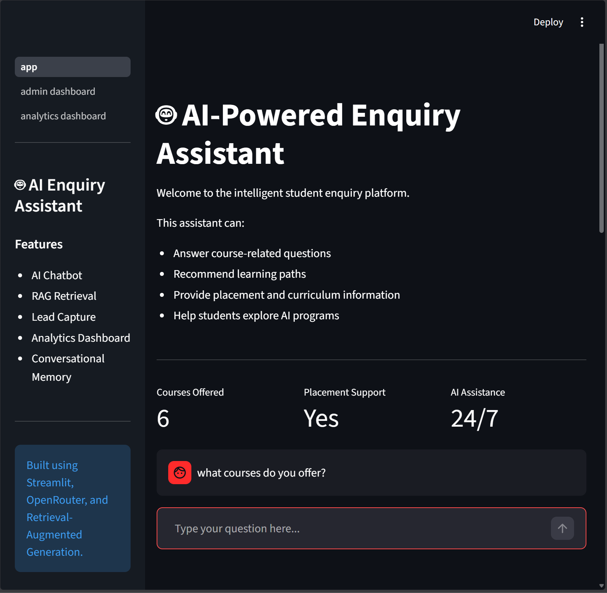
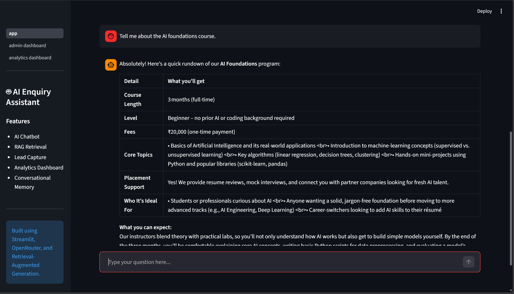
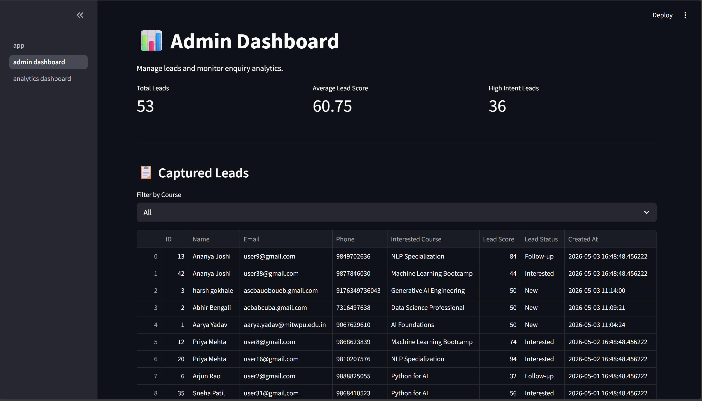
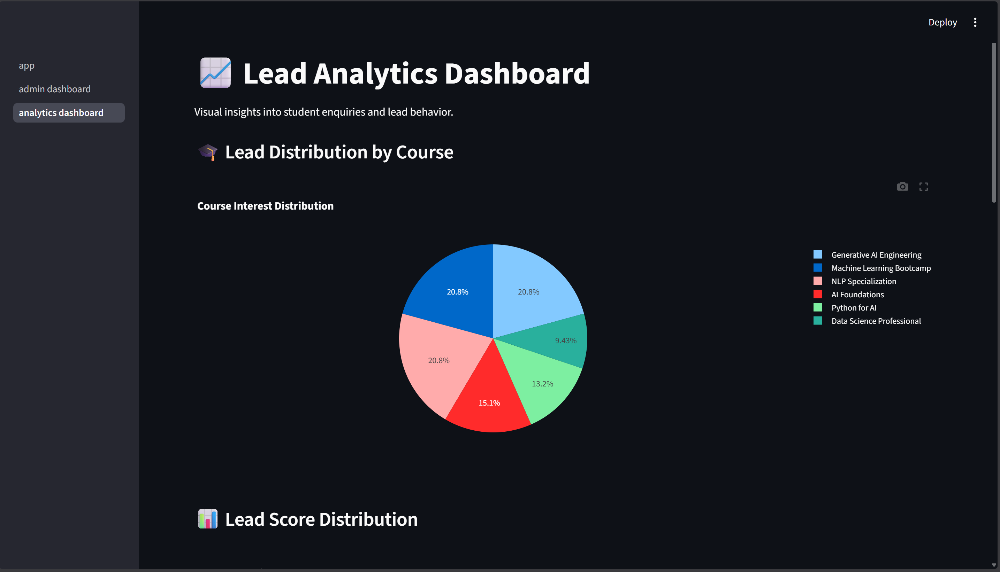
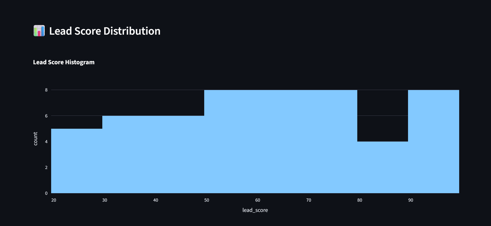
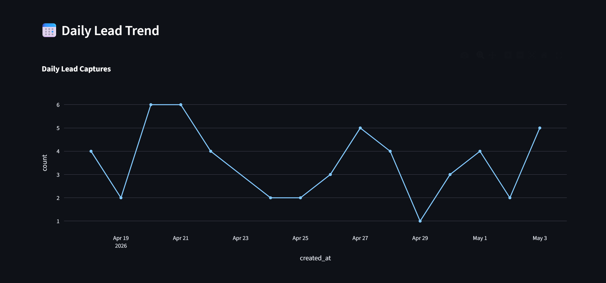
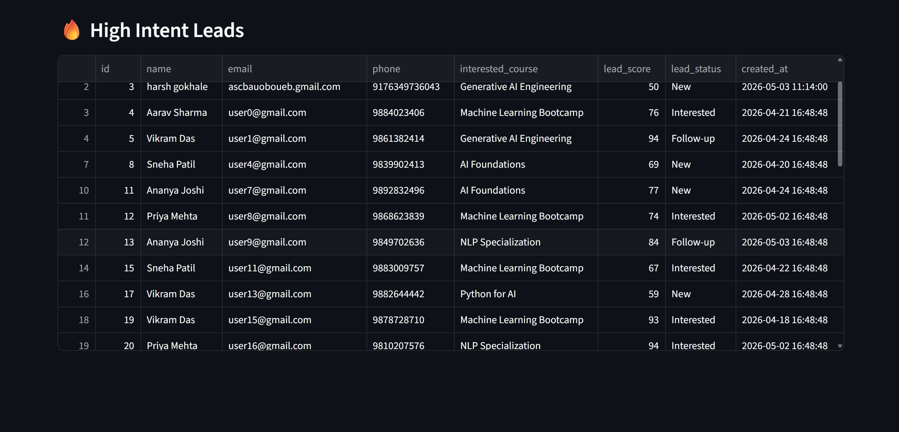

# 🤖 AI-Powered Enquiry Assistant

An intelligent AI-driven enquiry and lead management platform designed for educational institutions and training academies.

This project focuses on practical AI workflows, conversational intelligence, lead capture automation, and analytics.

---

# 🚀 Features

## 🧠 AI Chatbot

* Conversational AI assistant for student queries
* Context-aware multi-turn conversations
* Professional and human-like responses
* Course recommendation and information sharing

## 📚 RAG-Style Retrieval System

* Retrieves relevant institute/course information dynamically
* Context grounding using retrieval-based architecture
* Reduces hallucinations and improves response accuracy

## 📝 Lead Capture Workflow

* Detects student enrollment intent
* Dynamically displays lead capture forms
* Stores leads into SQLite database automatically

## 📊 Admin Dashboard

* View and manage captured leads
* Lead filtering by course
* Lead scoring and high-intent lead tracking
* CSV export functionality

## 📈 Analytics Dashboard

* Lead distribution analytics
* Course interest visualization
* Lead score analysis
* Daily lead trends
* High-intent lead insights

## 💬 Conversational Memory

* Maintains short-term conversation history
* Handles contextual follow-up questions naturally

---

# 🏗️ System Architecture

```text
User Query
    ↓
AI Chatbot Interface (Streamlit)
    ↓
Intent Detection + Conversational Memory
    ↓
Retrieval Pipeline (TF-IDF Retrieval)
    ↓
Relevant Context Retrieved
    ↓
LLM Response Generation (OpenRouter)
    ↓
Lead Detection
    ↓
SQLite Database Storage
    ↓
Admin Dashboard + Analytics
```

---

# 🛠️ Tech Stack

## Frontend

* Streamlit

## AI / NLP

* OpenRouter API
* OpenAI SDK
* Retrieval-Augmented Generation (RAG-style)
* TF-IDF Retrieval

## Backend

* Python
* SQLite

## Data & Analytics

* Pandas
* Plotly
* Scikit-learn

## Version Control

* Git & GitHub

---

# 📂 Project Structure

```text
AI_Enquiry_Assistant/
│
├── assets/
│   ├── architecture.png
│   ├── logo.png
│   └── styles.css
│
├── data/
│   ├── courses.csv
│   ├── faqs.txt
│   └── institute_info.txt
│
├── database/
│   └── leads.db
│
├── pages/
│   ├── admin_dashboard.py
│   └── analytics_dashboard.py
│
├── screenshots/
│
├── utils/
│   ├── chatbot.py
│   ├── database.py
│   ├── lead_scoring.py
│   ├── memory.py
│   ├── prompts.py
│   ├── rag_pipeline.py
│   └── recommender.py
│
├── app.py
├── generate_dummy_leads.py
├── requirements.txt
└── README.md
```

---

# ⚙️ Setup Instructions

## 1️⃣ Clone Repository

```bash
git clone <https://github.com/Aarya2304/AI_Enquiry_Assistant>
cd AI_Enquiry_Assistant
```

---

## 2️⃣ Create Virtual Environment

### Windows

```bash
python -m venv venv
venv\Scripts\activate
```

### Mac/Linux

```bash
python3 -m venv venv
source venv/bin/activate
```

---

## 3️⃣ Install Dependencies

```bash
pip install -r requirements.txt
```

---

## 4️⃣ Configure Environment Variables

Create a `.env` file in the root directory.

```env
OPENROUTER_API_KEY=your_api_key_here
```

---

## 5️⃣ Initialize Database

```bash
python utils/database.py
```

---

## 6️⃣ Run Application

```bash
python -m streamlit run app.py
```

---

# 📸 Screenshots

## Chatbot Interface

## Chatbot Interface






## Admin Dashboard

## Admin Dashboard



## Analytics Dashboard

## Analytics Dashboard









---

# 🧪 Example Workflow

1. Student asks course-related questions
2. Retrieval pipeline fetches relevant context
3. LLM generates grounded response
4. System detects enrollment intent
5. Lead capture form appears
6. Lead stored in SQLite database
7. Admin monitors leads via dashboard
8. Analytics dashboard visualizes trends and insights

---

# 🎯 Key Learnings

This project helped in understanding:

* AI workflow design
* Prompt engineering
* Conversational AI systems
* Retrieval-Augmented Generation (RAG)
* Lead management workflows
* Dashboard and analytics systems
* Database integration
* Real-world AI application architecture

---

# 🔮 Future Improvements

* WhatsApp API integration
* Real vector database support
* Email/SMS follow-up automation
* User authentication
* Multi-model AI routing
* Deployment on cloud platforms
* Advanced recommendation engine

---

# 👨‍💻 Author

Aarya Yadav

Computer Engineering (AI & Data Science)

---

# ⭐ Acknowledgements

Built as part of the **QuAnHack AI Workflow Challenge** focusing on practical AI-powered business workflows and automation systems.
